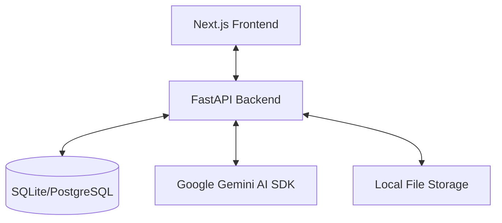

# Enterprise RFP Automation Platform: Architecture Guide

This document provides a deep dive into the technical architecture, data workflows, and system components of your RFP platform.

---

## 1. High-Level System Design

The platform is built as a modern full-stack application using a decoupled architecture:

### Core Technologies:
*   **Frontend**: Next.js 14+, Tailwind CSS, Lucide Icons.
*   **Backend**: FastAPI (Python), Uvicorn.
*   **Database**: SQLAlchemy ORM with SQLite (Current Dev) or PostgreSQL (Production).
*   **AI Engine**: Google GenAI SDK (Gemini 2.0 Flash).

---

## 2. The AI Ingestion Workflow (The "Superpower")

Unlike traditional chatbots that can only read a few pages, this system handles 100+ page RFPs with ease.

1.  **Direct Ingestion**: When you upload an RFP, the backend uses the `genai.upload_file` method.
2.  **File API**: The file is stored in Google's ephemeral file system.
3.  **Context Window**: We leverage Gemini's **1 Million+ token window**. This means the AI doesn't just "search" the document; it "reads" the whole thing.
4.  **Summary Generation**: The `ai_service.py` runs a multi-stage prompt to extract:
    *   **Executive Summary**: The "elevator pitch" of the project.
    *   **Financials**: Estimated value, EMD, and tender fees.
    *   **Risks**: Potential blockers and tight deadlines.

---

## 3. Backend Architecture Details

### **FastAPI & Pydantic**
*   **FastAPI**: Used for high-performance, asynchronous API endpoints.
*   **Pydantic**: Every data request and response is validated by a Pydantic schema (found in `app/schemas/rfp.py`). This prevents "dirty data" from entering the system.

### **SQLAlchemy & Database**
*   **Models**: Defined in `app/models/rfp.py`.
*   **Audit Logging**: Every decision (Approve, Reject, Hold) is logged in the `AuditLog` table for security and tracking.
*   **Quota Management**: The `QuotaUsage` model tracks daily API hits to prevent unexpected billing spikes.

---

## 4. Frontend Workspace Logic

### **CEO / PM Dashboard**
*   **Real-time KPI Sync**: The dashboard calls `GET /dashboard-summary` which aggregates counts directly from the database.
*   **Decision Workflow**: When a decision is made, it triggers a status change and an automatic **Notification** for the uploader.

### **AI Advisor Chatbot**
*   **Hybrid Mode**: Uses the current RFP context + General Knowledge.
*   **RFP-Only Mode**: Strictly limits the AI to only answer based on the uploaded document.
*   **Streaming**: We use `generate_content_stream` so you see the AI typing in real-time, rather than waiting for the whole answer.

---

## 5. Security & RBAC (Role-Based Access Control)

The system enforces strict rules:
*   **CEO/Admin**: Can upload, review, and assign.
*   **Solution Architect (SA)**: Can only see RFPs assigned to them and work on drafts.
*   **PM**: Can review and manage the pipeline.

---

## 6. Migration Path: Switching to Local LLMs (e.g., Gamma/Ollama)

If you decide to host your own model (like **Gamma** or **Llama 3**) on your local servers:

1.  **Replace Client**: In `ai_service.py`, replace the `genai.Client` with an `openai` or `requests` client pointing to your local endpoint (e.g., `http://localhost:11434/v1`).
2.  **Add Text Extraction**: Local models don't have a "File API." You will need to use `PyMuPDF` to convert PDFs to text before sending them to the model.
3.  **Implement RAG**: Since local models have smaller context windows (usually 32k-128k), you would need to implement **Retrieval-Augmented Generation** to "chunk" the document and find relevant parts.

---

> [!TIP]
> **Pro Tip**: To keep the platform "Premium," always ensure your `.env` file is protected and your API quotas are monitored via the dashboard health indicator.
